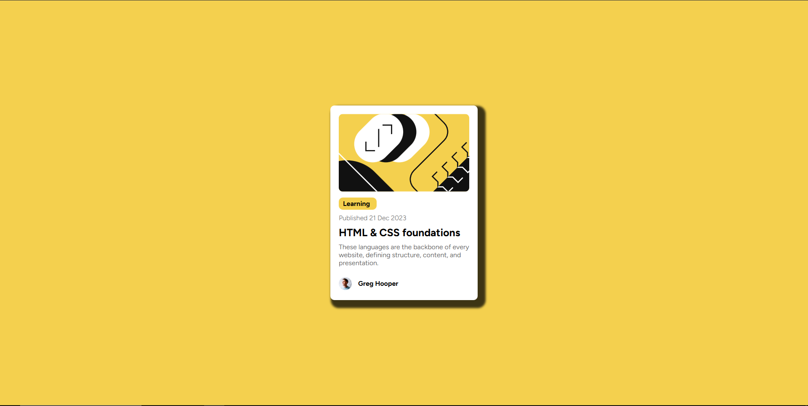

# Frontend Mentor - Blog preview card solution

This is a solution to the [Blog preview card challenge on Frontend Mentor](https://www.frontendmentor.io/challenges/blog-preview-card-ckPaj01IcS). Frontend Mentor challenges help you improve your coding skills by building realistic projects. 

## Table of contents

- [Overview](#overview)
  - [The challenge](#the-challenge)
  - [Screenshot](#screenshot)
- [My process](#my-process)
  - [Built with](#built-with)
  - [What I learned](#what-i-learned)
  - [Continued development](#continued-development)
  - [Useful resources](#useful-resources)

## Overview

### The challenge

Users should be able to:

- See hover and focus states for all interactive elements on the page

### Screenshot




## My process

### Built with

- Semantic HTML5 markup
- CSS custom properties
- Flexbox

### What I learned

I learned how to add custom css fonts to the project, from a folder. Learn how to use github to create a new repository, used git to commit changes and pushed to complete project to github.

```css

@font-face {
    font-family: ;
    src: url();
}
```

### Continued development
For future development I would like to focus more on flexbox.

### Useful resources

- [Resource 1](https://cssgenerator.org/) - This helped me generate the css for box-shadow. I really liked thew and will use it going forward.
- [Resource 2](https://www.w3schools.com/css/css3_fonts.asp) - This is an helped my add a custom font.


